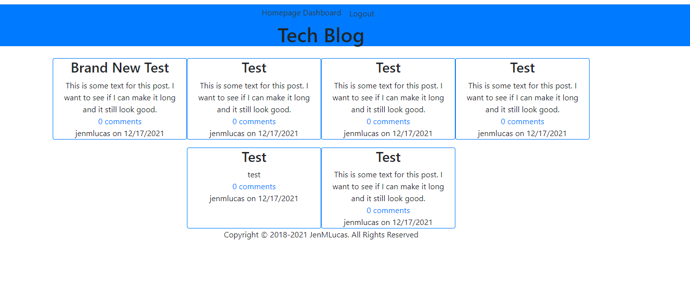

# Tech- Blog 

## Description
Tech Blog was created to give the user an opportunity to create and edit posts of their own and storing them on their personal dashboard as well as pasting them on the homepage for others to see. Once posted they can then receive comments from other users on their posts as well as comment on another users posts. If they made an error in a post and want to edit/ delete it, that will all be on their dashboard. All they need to do is sign up and sign in.

## Table of Contents (Optional)
* [Installation](#installation)
* [Usage](#usage)
* [License](#license)
* [Contributing](#contributing)
* [Test](#test)
* [Questions](#questions)

## Installation
Clone the repo, then do "npm install". Create a new .env file. Then open your Mysql and run "source db/schema.sql" once successful, run "quit". Follow this link https://stark-ravine-63905.herokuapp.com/ and your site will be up and running waiting for new posts. 

## Usage
This is what it will look like on your device. 

[Tech Blog](https://stark-ravine-63905.herokuapp.com/)

## License 
N/A

## Contributing
Jennifer Lucas 

## Tests 
N/A

## Questions
Please checkout my [Github](https://github.com/jenmlucas) for other projects. If you have any other questions or concerns, feel free to email me at jenmlucas1@gmail.com.